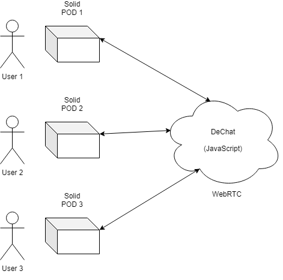
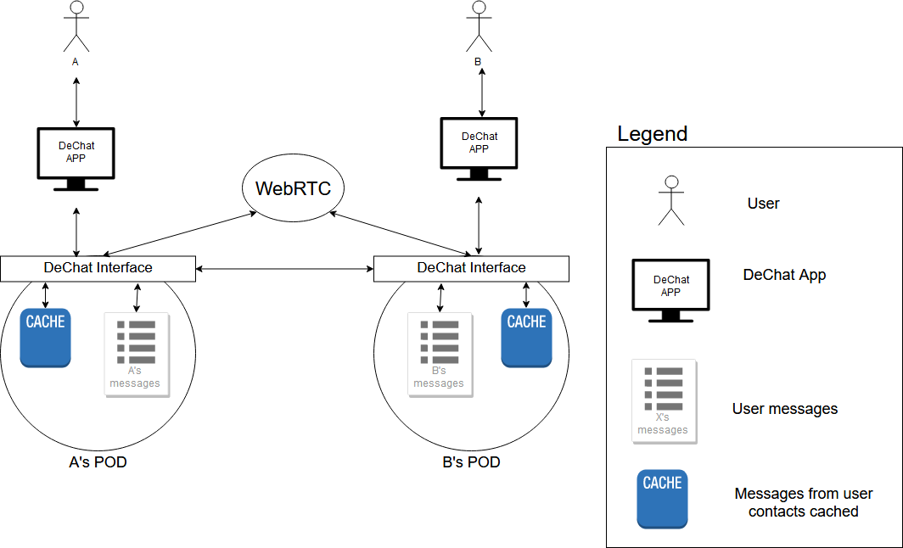

[[section-system-scope-and-context]]
== System Scope and Context

Our chat allows real-time peer-to-peer communication with a decentralized structure. This means that two people can exchange information between them without depending in a third person. Their information is never shared with anyone outside this direct communication channel.

This is possible thanks to the SOLID project. It allows each user to have it's own POD, kind of a personal data storage where all your information is saved, which through it different applications work.

=== Business Context

Here, the user's PODs are the communicating elements. Users write in their PODs and share that information with whoever they want. The data of the app is composed by the user's information, plus the links to other user's information that their owner has given the first user access to. External data can't be cached because it would break the decentralization principles.

Users log in to their PODs through our application, which is the responsible to link both users and establish the channel. WebRTC manages the writing and reading petitions in an asynchronous way for performance issues.

=== Technical Context

Using RDF we establish links between users. The process is divided in two steps: 

* An identificator that ensures that the POD and the user's data match, and allows the user to enter in the second part, if everything is correct.
* A chat where users can establish the connection with other users and share information between them in our decentralized chat.

