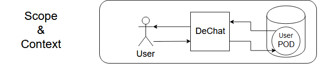

[[section-building-block-view]]

== Building Block View

=== Scope & Context
Users can read and write messages using DeChat, which, through a user-friendly interface, manages the POD storage and the data linking of the user and its contacts.

.Building Block View Legend
[%header,cols="^,<"]
|===
<| *Item* 
<| *Meaning*

a| image::images/BBV-legend-user.png[User]
| User(s) of the app, source of all human interactions with the system.

a| image::images/BBV-legend-interaction.png[Interaction]
| Interactions between entities, data structures or application blocks; flow of information.

a| image::images/BBV-legend-solidserver.png[Solid Server]
| Solid POD server, a server which, among other things, can host user PODs.

a| image::images/BBV-legend-solidpod.png[Solid POD]
| User's POD, a data structure for any kind of information. In our case, messages.

|===

=== Level 1

The first level of the Building Block View is a overall glance at the main blocks of the app:

image::images\building-block-viewV3-Part2.png[Level 1]

As the app is based in the Model-View-Controller structure, the purpose of the blocks is pretty clear in general lines. Nonetheless, there are details that need further explanation:

* Model
** Abstraction of the data structures needed for the app.
** Serves for storage of the information fetched from the POD.
** Is modified by the Controller and modifies the visual components of the View.

* View
** Form of interaction with the app for the users.
** Provides ways of interacting with complex components in a user-friendly way.
** Is modified by the Model and interacts with the Controller to get things done.

* Controller
** "Brain" of the app, knows what to do and how in order to perform several user operations
** Is formed by services, libraries and methods to work with either POD, user or app data.
** Is told by the View to perform actions and their results are reflected in the Model.

=== Level 2
* Model:
** contact.model.ts:
** chat.model.ts:
** friend.model.ts:
** message.model.ts:
* View:
** Contact List View:
** Chat View:
** Friend List View:
** Message View:
** Login View:
* Controller:

=== Whitebox Overall System

